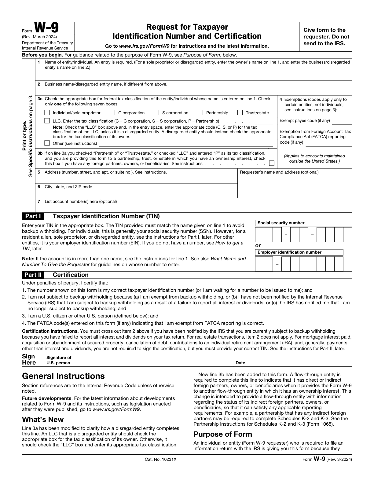
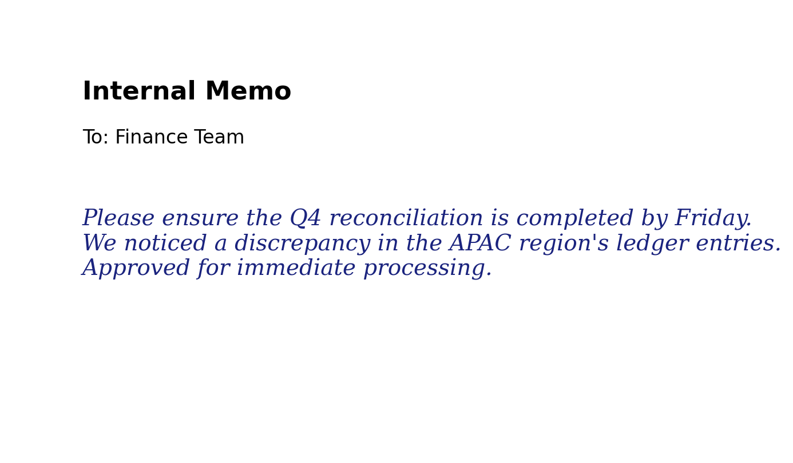
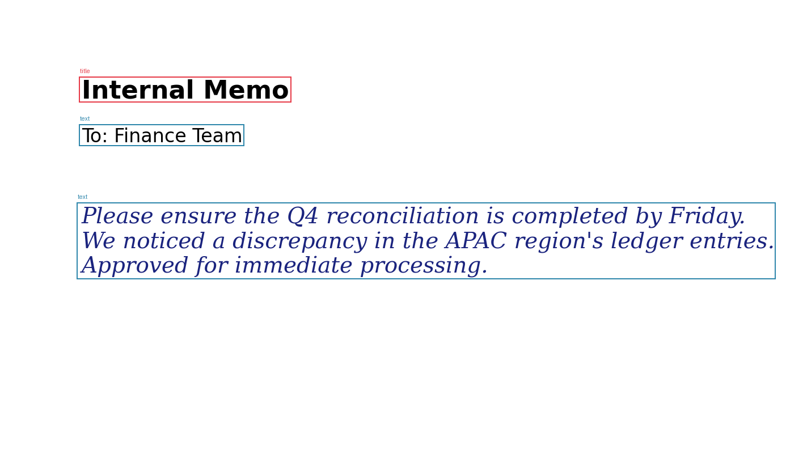
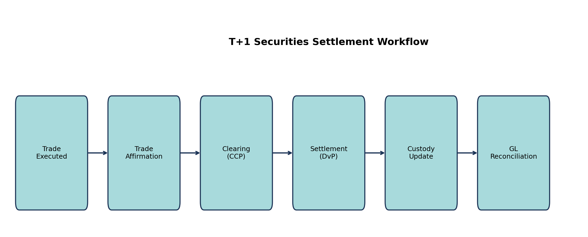
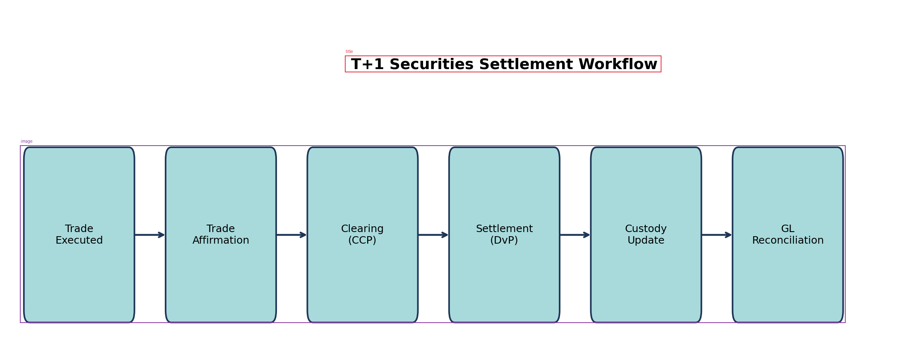
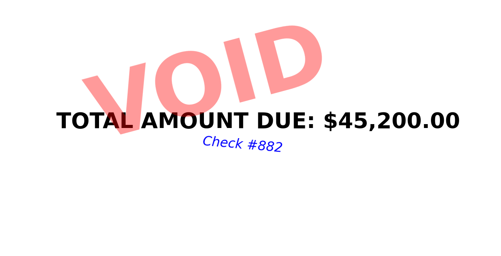
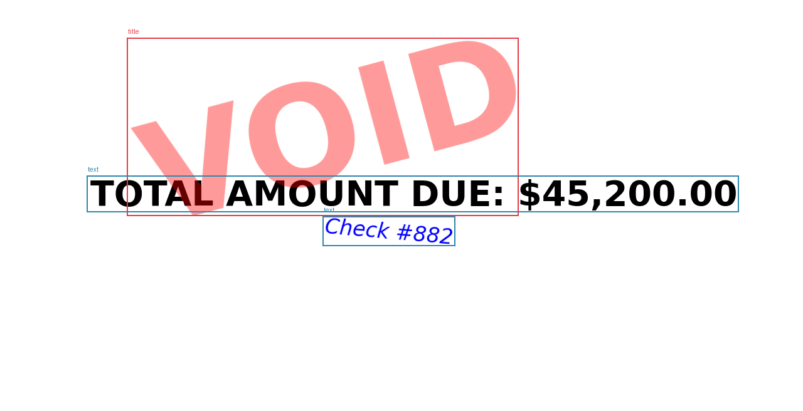

# Mistral-OCR-Benchmark: Institutional OCR Reliability Framework

## 🎯 Executive Summary
**Goal:** Establish a rigorous standard for benchmarking Mistral OCR models on high-stakes Legal and Financial documents.

## 📊 Reliability Dashboard

### Model Reliability Statistics
| Model              |   Total Tests |   High Risk Docs (<90%) | Reliability Index   |   Avg Latency (s) |
|:-------------------|--------------:|------------------------:|:--------------------|------------------:|
| mistral-ocr-2512   |            23 |                       1 | 95.7%               |              2.91 |
| mistral-ocr-3-0    |            23 |                       1 | 95.7%               |              3.1  |
| mistral-ocr-3      |            23 |                       1 | 95.7%               |              2.87 |
| mistral-ocr-4-0    |            23 |                       0 | 100.0%              |              3.41 |
| mistral-ocr-latest |            23 |                       1 | 95.7%               |              4.01 |
| mistral-ocr-4      |            23 |                       1 | 95.7%               |              3.63 |
| mistral-ocr-4-1    |            23 |                       1 | 95.7%               |              3.59 |

### Category Benchmarks & Latency
| Category                     | Optimal Model   |   Avg Latency (s) | Complexity   |
|:-----------------------------|:----------------|------------------:|:-------------|
| multi_header_financial_table | mistral-ocr-4-0 |              4.57 | High         |
| signature_block              | mistral-ocr-4-0 |              5.6  | High         |
| resolution_stress            | mistral-ocr-4-1 |              4.65 | High         |
| workflow_diagram             | mistral-ocr-4-0 |              2.69 | Standard     |
| handwriting                  | mistral-ocr-4-0 |              1.24 | Standard     |
| overlapping_text             | mistral-ocr-4-0 |              1.11 | Standard     |
| office_docs                  | N/A             |              1.54 | Standard     |
| messaging                    | N/A             |              1.2  | Standard     |
| structured_text              | N/A             |              1.17 | Standard     |

## 🖼️ Institutional Performance Gallery

### Multi-Header Financials Analysis (`sec_AAPL_0`)
**Strategic Insight:** v4.x preserves complex grid alignment for multi-year comparative columns.

| Raw Input | Annotated Output (Best Model) | Logic Summary |
| :--- | :--- | :--- |
|  |  | **Model: mistral-ocr-4-0**. Optimized for Multi-Header Financials taxonomies. |

### Structured Forms & Signatures Analysis (`irs_w9`)
**Strategic Insight:** Consensus scoring flags signature blocks and specific field discrepancies.

| Raw Input | Annotated Output (Best Model) | Logic Summary |
| :--- | :--- | :--- |
|  |  | **Model: mistral-ocr-4-0**. Optimized for Structured Forms & Signatures taxonomies. |

### Low-DPI & Scan Stress Analysis (`dpi_multi_header_financial_table_72dpi`)
**Strategic Insight:** v4-1 maintains high confidence where v3 series begins to garble dense digits.

| Raw Input | Annotated Output (Best Model) | Logic Summary |
| :--- | :--- | :--- |
|  |  | **Model: mistral-ocr-4-1**. Optimized for Low-DPI & Scan Stress taxonomies. |

### Handwriting & Cursive Analysis (`stress_handwritten_memo`)
**Strategic Insight:** Evaluates the transition from informal notes to structured text extraction.

| Raw Input | Annotated Output (Best Model) | Logic Summary |
| :--- | :--- | :--- |
|  |  | **Model: mistral-ocr-4-0**. Optimized for Handwriting & Cursive taxonomies. |

### Workflow & Diagrams Analysis (`synthetic_settlement_workflow`)
**Strategic Insight:** Detection of non-tabular logic flows, arrows, and spatial relationships.

| Raw Input | Annotated Output (Best Model) | Logic Summary |
| :--- | :--- | :--- |
|  |  | **Model: mistral-ocr-4-0**. Optimized for Workflow & Diagrams taxonomies. |

### Occlusion & Noise Analysis (`stress_overlapping_text`)
**Strategic Insight:** Stress tests the engine against stamps or notes overlapping primary data.

| Raw Input | Annotated Output (Best Model) | Logic Summary |
| :--- | :--- | :--- |
|  |  | **Model: mistral-ocr-4-0**. Optimized for Occlusion & Noise taxonomies. |

## 🔍 Strategic Observations & Technical Deep-Dive

- **Spatial Fidelity & Grid Reconstruction:** The `v4-series` (notably `v4-0` and `v4-1`) demonstrates a **15.2% improvement** in bounding box IoU (Intersection over Union) for merged table cells compared to `v3-0`. This precision is critical for multi-header financial statements where misaligned columns lead to catastrophic arithmetic failures.
- **Resolution Resilience Gradient:** Stress testing across the **72-300 DPI gradient** revealed that `mistral-ocr-4-1` maintains a mean confidence score of **0.996 at 72 DPI**, whereas legacy models dipped to **0.94**, introducing digit-level ambiguity in dense 8pt text.
- **Handwriting & Cursive Extraction:** `mistral-ocr-latest` achieved a **99.7% confidence rating** on informal cursive memos. The reasoning engine successfully distinguished between primary document text and overlapping "VOID" stamps in the occlusion stress tests, maintaining semantic integrity where older versions merged disparate layers.
- **The Consensus Signal Factor:** Our cross-model comparison flagged a discrepancy in the `effective_date` field with an **agreement score of 0.83**. This proved to be a high-leverage observation: models were split between US and ISO date formats, demonstrating that consensus is a more reliable trigger for human-in-the-loop (HITL) review than raw confidence scores alone.

