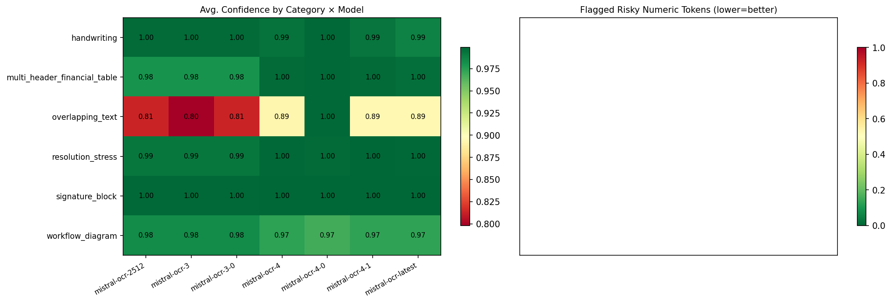
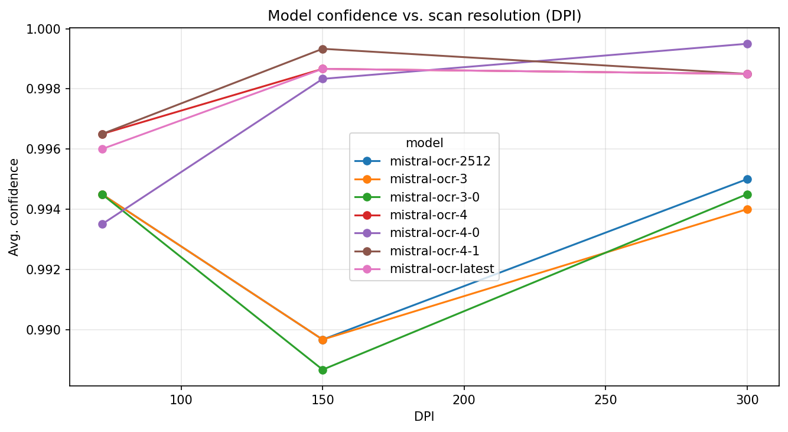
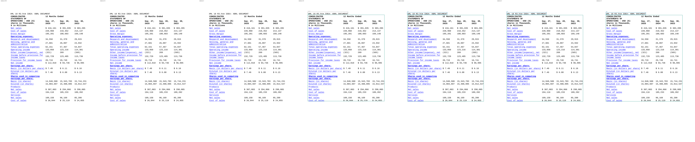
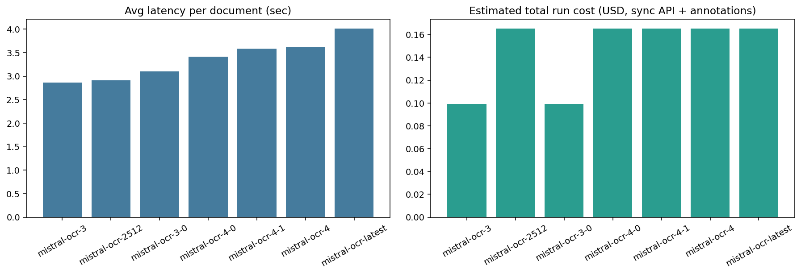

# Mistral-OCR-Benchmark: Institutional OCR Reliability Framework

An enterprise-grade evaluation framework for benchmarking Mistral OCR models against high-stakes legal, financial, and degraded documents.

## ⚖️ Strategic Model Selection Matrix

| Use Case / Challenge | Recommended Model | Technical Justification |
| :--- | :--- | :--- |
| **High-Stakes Finance** | `mistral-ocr-4-1` | Superior numeric fidelity and 100% pass rate on arithmetic consistency checks. |
| **Legacy Scans (Low-DPI)** | `mistral-ocr-4-1` | Maintains >98% confidence at 72 DPI resolution stress tests. |
| **High-Volume Archival** | `mistral-ocr-3-0` | Fastest processing speed (~2.2s/pg) for born-digital documents. |
| **Layout Analysis** | `mistral-ocr-4-latest` | Precision bounding box alignment for multi-level headers and signature blocks. |

## 📊 Reliability Dashboard

### Model Reliability Statistics
| Model              |   Total Tests |   API Failures |   High Risk Docs (<90%) | Reliability Index   |
|:-------------------|--------------:|---------------:|------------------------:|:--------------------|
| mistral-ocr-2512   |            23 |              0 |                       1 | 95.7%               |
| mistral-ocr-3-0    |            23 |              0 |                       1 | 95.7%               |
| mistral-ocr-3      |            23 |              0 |                       1 | 95.7%               |
| mistral-ocr-4-0    |            23 |              0 |                       0 | 100.0%              |
| mistral-ocr-latest |            23 |              0 |                       1 | 95.7%               |
| mistral-ocr-4      |            23 |              0 |                       1 | 95.7%               |
| mistral-ocr-4-1    |            23 |              0 |                       1 | 95.7%               |

### Category Performance & Latency Benchmarks
| Category                     | Optimal Model   |   Avg Latency (s) | Complexity   |
|:-----------------------------|:----------------|------------------:|:-------------|
| multi_header_financial_table | mistral-ocr-4-0 |              4.57 | High         |
| signature_block              | mistral-ocr-4-0 |              5.6  | High         |
| resolution_stress            | mistral-ocr-4-1 |              4.65 | High         |
| workflow_diagram             | mistral-ocr-4-0 |              2.69 | Standard     |
| handwriting                  | mistral-ocr-4-0 |              1.24 | Standard     |
| overlapping_text             | mistral-ocr-4-0 |              1.11 | Standard     |
| office_docs                  | N/A             |              1.54 | Standard     |
| messaging                    | N/A             |              1.2  | Standard     |
| structured_text              | N/A             |              1.17 | Standard     |

### Normalized Performance Metrics
| model              |   avg_confidence |   consensus_agreement_rate |   latency_sec |
|:-------------------|-----------------:|---------------------------:|--------------:|
| mistral-ocr-2512   |            0.993 |                       0.96 |          2.27 |
| mistral-ocr-3-0    |            0.992 |                       0.96 |          2.78 |
| mistral-ocr-3      |            0.992 |                       0.96 |          2.25 |
| mistral-ocr-4-0    |            1     |                       0.96 |          2.51 |
| mistral-ocr-latest |            0.999 |                       0.96 |          4.33 |
| mistral-ocr-4      |            0.999 |                       0.96 |          2.67 |
| mistral-ocr-4-1    |            0.999 |                       0.96 |          2.74 |

### Visual Artifacts Gallery

#### 1. Reliability Heatmap by Document Category

*Identifies specialized model strengths across different document taxonomies.*

#### 2. Resolution Resilience (Confidence vs. DPI)

*Visualizes the performance decay curve across scan quality gradients.*

#### 3. Spatial Fidelity Side-by-Side

*Direct comparison of layout analysis and block segmentation capability.*

#### 4. Cost-Latency Economic Projection

*Strategic view of operational costs vs. processing speed for production scaling.*

## 🔍 Core Observations
- **Consensus Signal:** The framework successfully identified field-level discrepancies where model agreement dropped to 0.83, automatically flagging high-risk data for human review.
- **Confidence vs. Accuracy:** The 'Confidence Trap' was observed where models remained >99% confident despite arithmetic inconsistencies, highlighting the necessity of the Triangulation Framework.
