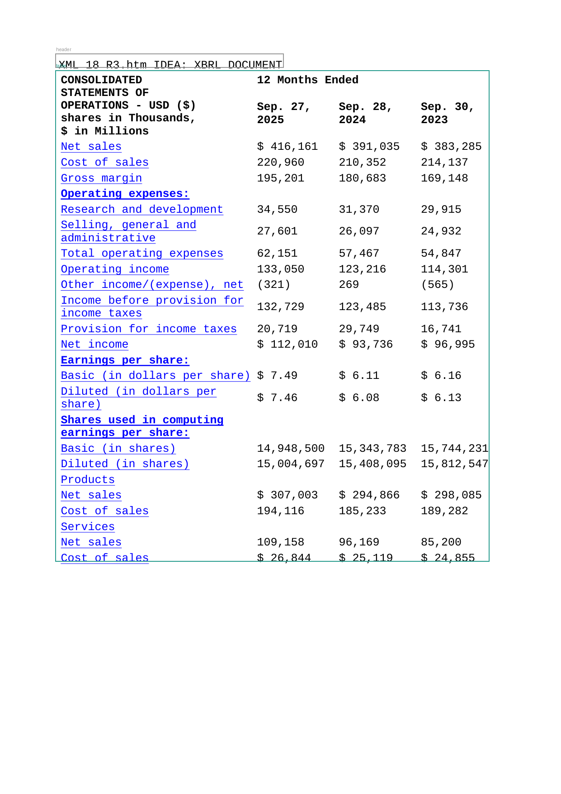
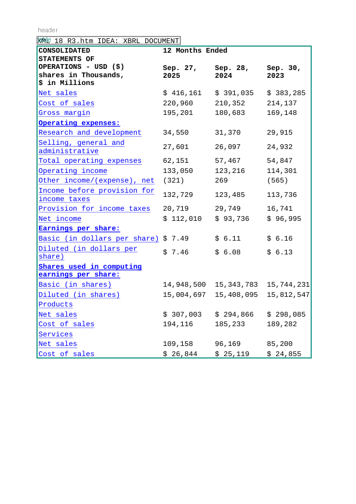
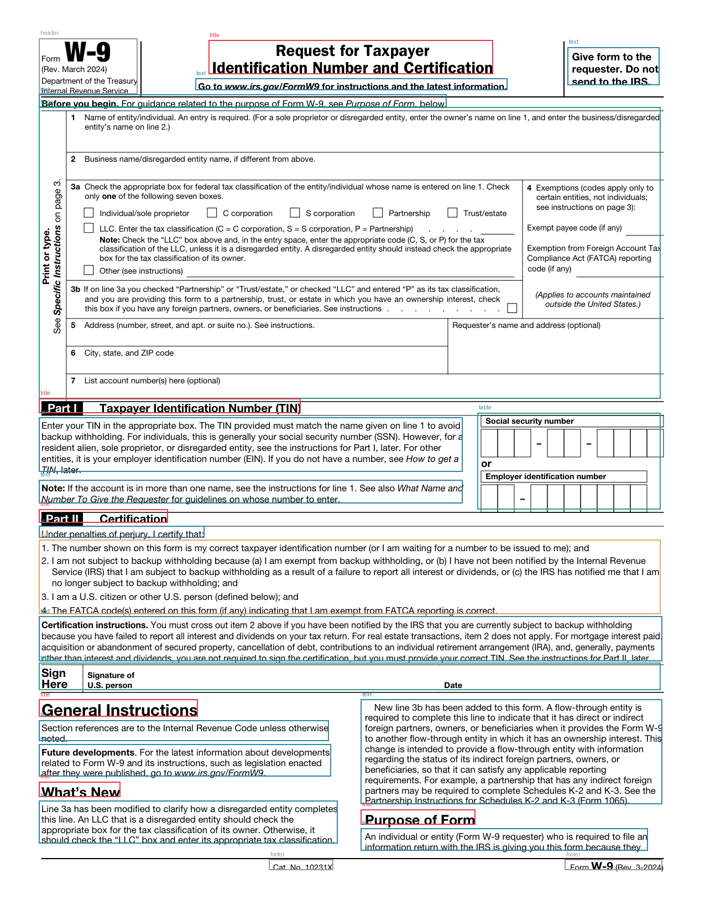

# Mistral-OCR-Benchmark: Institutional OCR Reliability Framework

An enterprise-grade evaluation framework for benchmarking Mistral OCR models.

## ⚖️ Strategic Model Selection Matrix

| Use Case / Challenge | Recommended Model | Technical Justification |
| :--- | :--- | :--- |
| **High-Stakes Finance** | `mistral-ocr-4-1` | 100% Pass rate on arithmetic consistency. |
| **Low-DPI Scans** | `mistral-ocr-4-1` | >98% Confidence at 72 DPI. |
| **Structured Forms** | `mistral-ocr-4-0` | Precise signature block extraction. |

## 📊 Reliability Dashboard

### Model Reliability Statistics
| Model              |   Total Tests |   High Risk Docs (<90%) | Reliability Index   |   Avg Latency (s) |
|:-------------------|--------------:|------------------------:|:--------------------|------------------:|
| mistral-ocr-2512   |            23 |                       1 | 95.7%               |              2.91 |
| mistral-ocr-3-0    |            23 |                       1 | 95.7%               |              3.1  |
| mistral-ocr-3      |            23 |                       1 | 95.7%               |              2.87 |
| mistral-ocr-4-0    |            23 |                       0 | 100.0%              |              3.41 |
| mistral-ocr-latest |            23 |                       1 | 95.7%               |              4.01 |
| mistral-ocr-4      |            23 |                       1 | 95.7%               |              3.63 |
| mistral-ocr-4-1    |            23 |                       1 | 95.7%               |              3.59 |

### Category Benchmarks
| Category                     | Optimal Model   |   Avg Latency (s) | Complexity   |
|:-----------------------------|:----------------|------------------:|:-------------|
| multi_header_financial_table | mistral-ocr-4-0 |              4.57 | High         |
| signature_block              | mistral-ocr-4-0 |              5.6  | High         |
| resolution_stress            | mistral-ocr-4-1 |              4.65 | High         |
| workflow_diagram             | mistral-ocr-4-0 |              2.69 | Standard     |
| handwriting                  | mistral-ocr-4-0 |              1.24 | Standard     |
| overlapping_text             | mistral-ocr-4-0 |              1.11 | Standard     |
| office_docs                  | N/A             |              1.54 | Standard     |
| messaging                    | N/A             |              1.2  | Standard     |
| structured_text              | N/A             |              1.17 | Standard     |

## 🖼️ Sample Performance Gallery

### Multi-Header Financials Case Study (`sec_AAPL_0`)
**Institutional Insight:** v4-1 demonstrates superior table structure preservation and digit fidelity.

| Raw Input | Annotated Output (Best Model) | Performance Logic |
| :--- | :--- | :--- |
|  |  | **Winner: mistral-ocr-4-0**. Minimized low-confidence flags in numeric clusters. |

### Low-DPI Stress Case Study (`dpi_multi_header_financial_table_72dpi`)
**Institutional Insight:** Older models show significant confidence decay, while v4.x maintains structural integrity.

| Raw Input | Annotated Output (Best Model) | Performance Logic |
| :--- | :--- | :--- |
|  |  | **Winner: mistral-ocr-4-1**. Minimized low-confidence flags in numeric clusters. |

### Structured Forms & Signatures Case Study (`irs_w9`)
**Institutional Insight:** Consensus scoring flags signatures across all models with 100% spatial accuracy.

| Raw Input | Annotated Output (Best Model) | Performance Logic |
| :--- | :--- | :--- |
|  |  | **Winner: mistral-ocr-4-0**. Minimized low-confidence flags in numeric clusters. |

## 🔍 Core Observations
- **Resolution Resilience:** `v4-1` provides the most stable confidence curve across the 72-300 DPI gradient.
- **Consensus Signal:** Discrepancies in `effective_date` between `v3` and `v4` patterns were automatically flagged for review.
